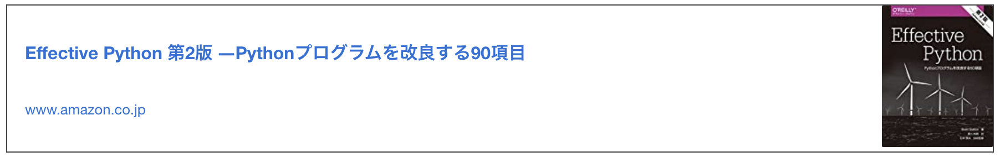
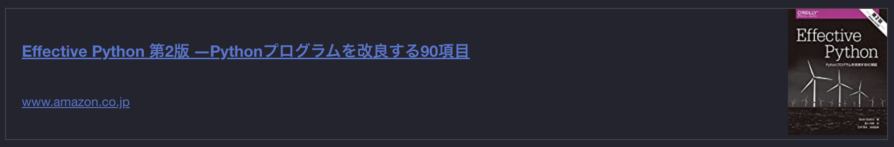

<p align="center">
  <a href="https://www.gatsbyjs.com">
    
  </a>
</p>
<h1 align="center">
  gatsby-remark-amazon-link
</h1>

## Features

This plugin is replaced markdown's amazon link with beautiful linkcard used [Amazon PA API v5](https://webservices.amazon.com/paapi5/documentation/).





## Install

1. Install package.

```bash
npm install --save gatsby-remark-amazon-link
```

2. Enable plugin in your `gatsby-config.js`.

```js
plugins: [
  {
    resolve: `gatsby-remark-amazon-link`,
    options: {
      accessKey: "xxxxxxxxxxxx",
      secretKey: "xxxxxxxxxxxx",
      partnerTag: "xxxxxxx-22",
      marketplace: "www.amazon.co.jp",
    }
  }
];
```

3. Load css in your `gatsby-browser.js`.

```js
import 'gatsby/styles/default.css';
```

## Usage

Write amazon link on your markdown file!

```markdown
[$amazon](https://amazon.co.jp/dp/B00000000/?xxxxxx)
```

## Option

| name         | default        | description                               |
| ------------ | -------------- | ----------------------------------------- |
| accessKey    | (required)     | Amazon PA-API v5 access key               |
| secretKey    | (required)     | Amazon PA-API v5 secret key.              |
| partnerTag   | (required)     | Amazon Associate Partner Tag(ex. hoge-22) |
| marketplace  | `amazon.co.jp` | Amazon market region.                     |
| convertTitle | `$amazon`      | Replace markdown's link title             |

### Optional: CSS

If you want to change the design of the linkcard yourself,
please use [this css](./styles/default.css) as a reference.

## Reference

[Amazon PA-API v5 doc](https://webservices.amazon.com/paapi5/documentation/)

[gatsby-remark-link-beautify](https://github.com/Talaxy009/gatsby-remark-link-beautify.git)
